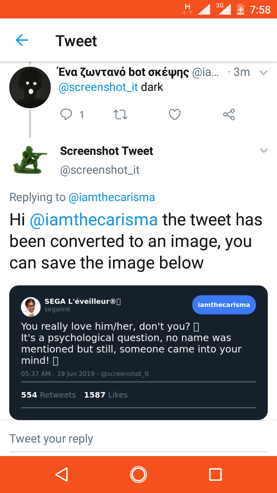

# <p style="text-align: center;" align="center">screenshot_it</p>

<p style="text-align: center;" align="center">Screenshot and Save a tweet as image</p>

___

When you see an interesting tweet it can easilly get burried in your twitter feed under newer tweets. However  
if you want to capture the tweets you can use this bot to fetch an image version of the tweet. 

There are other method of screen shotting a tweet all which requires extra desktop tools such as snipe tool or
the need to install browser extension just to save the tweet as image. With **@screenshot_it** you can easily get 
the image version of the tweet without leaving twitter. 

Mention the bot (@screenshot_it) in a reply to any tweet you want to save as an image, and it'll reply with an image of the tweet in a few minutes 
and you can save the image to your device.



The replay accept two extra arguments to customize the image that is generated.
	
	`dark` : To generate an image with the twitter dark theme
	`nostat` : To exclude the likes and retweet count from the generated image
	
e.g 

```
@screenshot_it dark nostat
```
will generate an image with the dark theme with no statistics 

### License

GNU General Public License v3 Copyright (c) 2019 Azeez Adewale Built with :heart:
